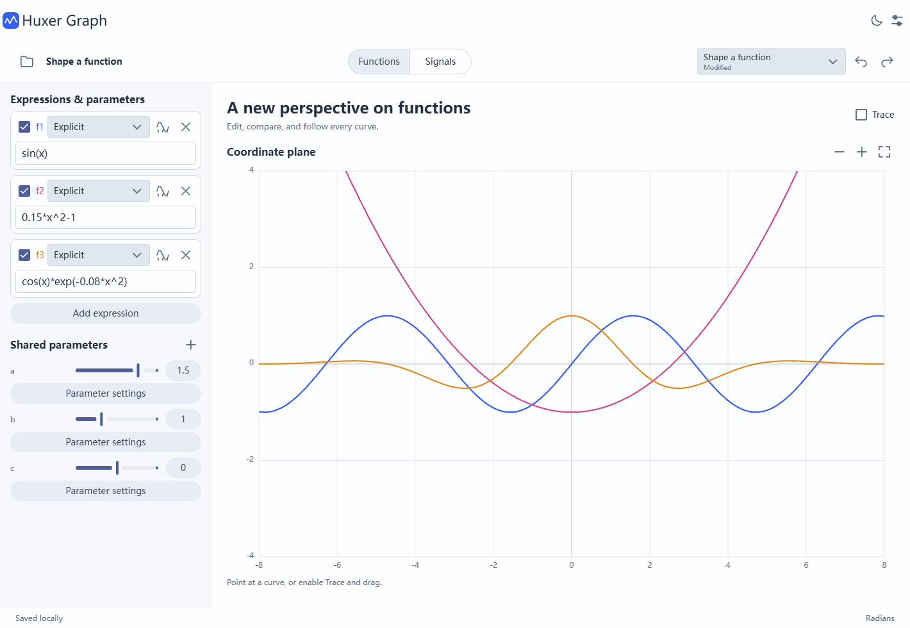
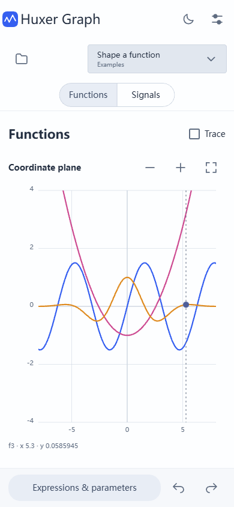
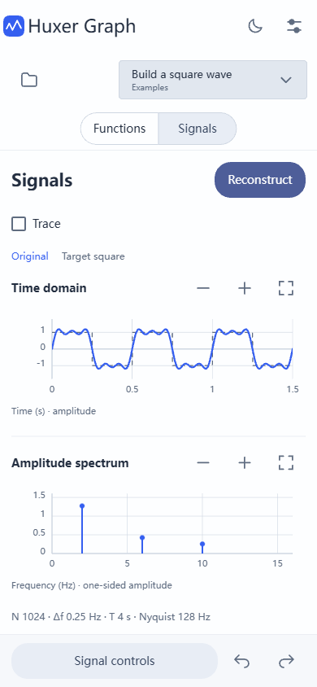

# Huxer Graph

An offline function editor and signal laboratory built with HuxerUI. Edit formulas, explore parameters, synthesize waves, inspect their Fourier spectrum, and reconstruct a signal from edited frequency components. The curves and transforms use real numerical calculations.

Created with `huxerui create app Huxer-Graph --id com.huxerui.demos.huxergraph --platform all --agent none`. The six generated platform shells share the same C++ application and mathematical core.

These English screenshots show the compiled HuxerUI Web application in Chrome with the Material theme. They are separate from the earlier design prototype.

The theme uses neutral gray surfaces and muted indigo controls, reserving stronger colors for plotted data. Desktop parameter controls use compact inline rows; compact screens retain larger touch targets. Primary actions are filled, while secondary actions use tonal backgrounds.



<table>
  <tr><th>Functions · compact Web viewport</th><th>Signals · compact Web viewport</th></tr>
  <tr>
    <td></td>
    <td></td>
  </tr>
</table>

## Explore

The Examples select shows the current preset and marks edited formulas, parameters, or signal settings as Modified. Switching presets requires confirmation; canceling keeps the current selection. Example identity is saved with the experiment, and restoring the original values clears the modified marker. Untagged documents appear as Custom experiment.

**Functions** supports explicit `y(x)`, parametric `(x(t), y(t))`, and polar `r(theta)` curves. Each expression has visibility, diagnostics, and shared parameters with editable ranges and steps. Pan the coordinate plane, zoom around the pointer or pinch centroid, fit the sampled curves, edit numeric bounds, or enable Trace to inspect a curve. Explicit functions can be sampled into Signals over the current x interval; the sample operation preserves the function's angle mode and parameter values.

**Signals** provides an odd-harmonic square-wave series, a mixer of sine/square/triangle/saw/DC oscillators, custom expressions, and CSV samples. Amplitude, frequency, phase, sample rate, sample count, analysis window, mean removal, and linear/dB display are editable. Time and frequency views update together.

**Reconstruct** freezes the original sample record. Edit a positive-frequency bin's amplitude and phase or apply a low-pass cutoff; the inverse transform updates the reconstructed waveform and RMS difference. DC and Nyquist use signed real coefficients. Apply commits the reconstructed samples; Discard restores the source settings.

Eight examples cover square-wave synthesis, parameterized functions, discontinuities, Lissajous figures, polar curves, beats, spectral leakage, and aliasing. Project actions include rename, open/save `.hgraph`, CSV import, and SVG/time CSV/spectrum CSV export. Undo/redo groups slider drags and expression edits. Autosave keeps the current and previous experiment locally.

Compact layouts keep the plots primary and move editing into a scrollable bottom sheet. Short viewports can scroll the plotting workspace instead of flattening its graphs. Workspace switching uses Pager. The app includes light/dark themes and English, Simplified/Traditional Chinese, Japanese, Korean, French, German, Spanish, and Brazilian Portuguese resources.

## Run

Install the HuxerUI SDK and the toolchain for the chosen platform, then run these commands from this directory:

```sh
huxerui build windows --profile debug
huxerui run windows --profile debug
huxerui build android --profile debug
huxerui build web --profile debug
```

For Android, `--java-home <JDK-directory>` can select a JDK explicitly. Serve the generated Web output through HTTP on localhost or HTTPS; opening the HTML through `file://` is insufficient. The first build downloads the pinned numerical dependencies. Normal application use works offline.

| Platform | Status in this development environment |
| --- | --- |
| Windows | Built and launched; native UI inspected |
| Android | Debug APK built; a connected device is still required for native touch, keyboard, and lifecycle validation |
| Web | Built and run in Chrome; desktop/compact layouts, formula errors, reconstruction, and local reload exercised. File-picker export was not completed in headless Chrome |
| Linux, macOS, iOS | Generated project shells; not built on this Windows host |

## Mathematical contract

Use explicit multiplication: `2*sin(x)`, not `2sin(x)`. Expressions accept `+ - * / ^`, comparisons, Boolean operators, and the conditional `condition ? a : b`. Functions include `sin`, `cos`, `tan`, `asin`, `acos`, `atan`, `sqrt`, `abs`, `exp`, `ln`, `log10`, `floor`, `ceil`, `min`, and `max`; constants are `pi` and `e`. The coordinate aliases `x`, `t`, and `theta` refer to the active independent variable. Assignments and executable code are rejected. Functions use the selected radian/degree mode; signal expressions use radians and seconds.

Adaptive curve sampling splits nonfinite values and large unresolved jumps. This is a numerical visualizer, not a symbolic solver: extremely narrow features can be missed, and Fit considers the sampled interval rather than proving a function's global bounds.

The FFT uses an unscaled forward transform and a `1/N` inverse. One-sided amplitude divides by the analysis window sum and doubles interior positive-frequency bins; DC and Nyquist are not doubled. Phase is in degrees and hidden below a relative amplitude threshold. The dB display is relative to one amplitude unit and has a -120 dB floor. Reconstruction always uses the raw frozen record, not the windowed/mean-removed analysis data, and maintains conjugate symmetry.

CSV import accepts numeric comma/tab-delimited columns, one optional header, and `#` metadata lines. Choose a timestamp column or supply the sample rate. Timestamps must be uniformly spaced; nonuniform data is rejected. Records need 256–65536 rows. The selected FFT length is the largest supported power of two within the record; extra imported samples remain in the project. This importer does not implement quoted text fields or resampling.

Limits: 24 expressions, 32 shared parameters, 16 oscillators, 2048 characters per expression, 48 nesting levels, 256–65536 FFT samples, and 10 MiB per imported file. Native numerical updates run on workers with cancellation; the current Web build evaluates bounded jobs on its application thread, so large expressions or sample records can briefly delay interaction.

## Persistence and verification

`.hgraph` is a versioned JSON document containing expressions, parameter values, coordinate ranges, signal settings, imported samples, and reconstruction edits. It excludes compiled parser and plotting caches. Autosave debounces changes, writes a pending file, retains the previous save, and replaces the current save. A malformed current document triggers a previous-document recovery attempt and a visible error. Abrupt process termination or browser closure before autosave finishes can lose the latest edits; use Save a copy for an explicit portable file.

Build the independent numerical tests without the UI SDK from a configured C++ compiler environment:

```sh
cmake -S tests -B build/math-tests
cmake --build build/math-tests --config Debug
ctest --test-dir build/math-tests -C Debug --output-on-failure
```

The checks cover expression precedence and validation, degree conversion, discontinuity gaps, harmonic amplitude and phase, window gain, FFT versus direct DFT, inverse reconstruction, DC/Nyquist normalization, conjugate symmetry, document round trips, CSV validation, SVG generation, and function sampling into signals.

The [design proposal](../docs/huxer-graph/README.md) also describes future refinements. Parameter playback, a recent-project gallery, file-drop/open-with integration, and configurable plotting quality are not exposed in this implementation. Implicit curves, CAS, 3D, and live audio remain outside its scope. Mobile Web checks do not replace Android device validation.

## Source and dependencies

`src/` contains HuxerUI composition, controls, canvas plotting, dialogs, and application state. `core/` is independent C++ numerical/document code. `tests/` verifies that core. `resources/` contains localized text, SVG icons, and bundled third-party notices. Existing demos and the HuxerUI SDK are unchanged.

| Dependency | Pinned revision | License |
| --- | --- | --- |
| muparser | `508cce97d983c4c61099ceacc11c984a60053967` | BSD-2-Clause |
| KISS FFT | `e5e3fac46e0d94a8f8170c06706b7a4218828333` | BSD-3-Clause |
| nlohmann/json | `65ee68451d8eb2b5f3a30b410476ab83deb3289b` | MIT |

Revisions and build options are declared in [cmake/Dependencies.cmake](cmake/Dependencies.cmake). Full notices are distributed in [resources/raw/third_party_licenses.txt](resources/raw/third_party_licenses.txt).
