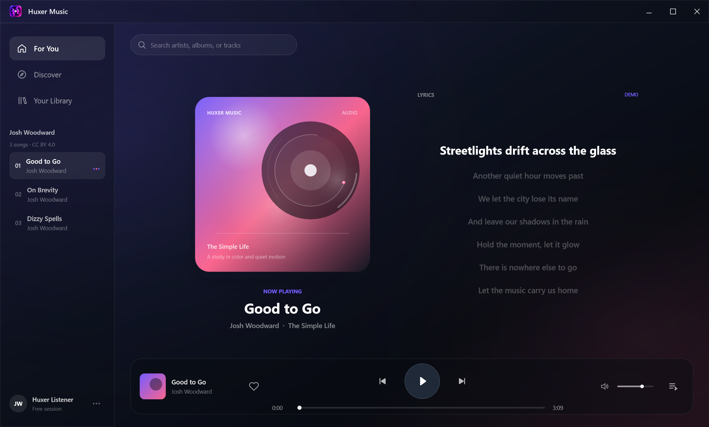
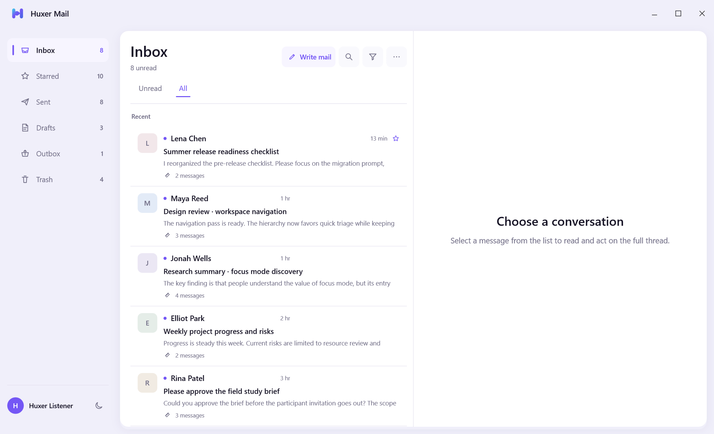
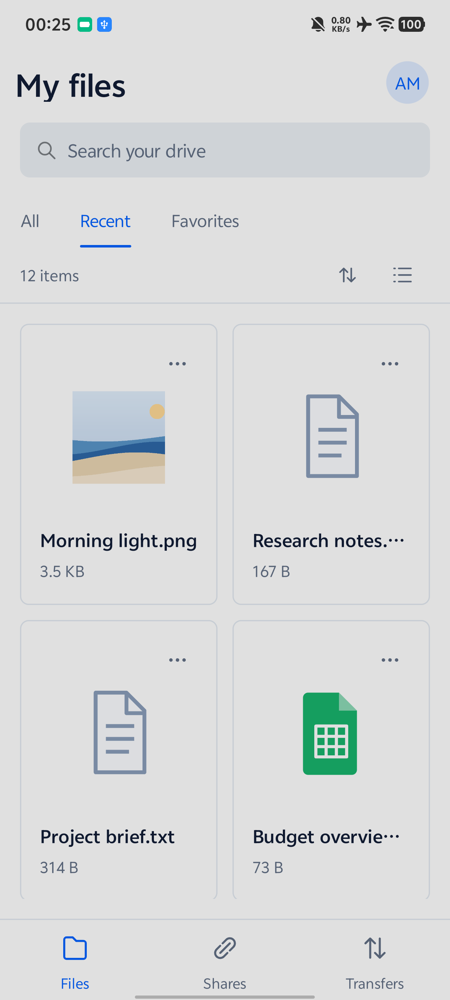
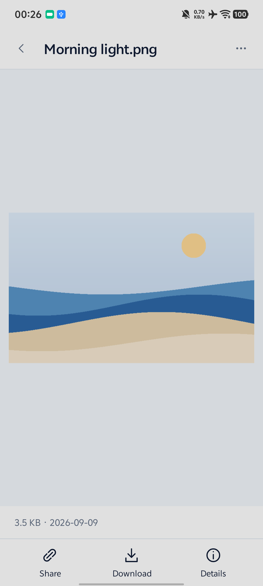

# HuxerUI Demos

Complete applications built with HuxerUI, from a three-column mail workspace to a touch-first personal drive and an immersive music player.

Each demo has its own visual identity, responsive navigation, and working user flows. Explore the interfaces below, then open a project to build and run it with the public HuxerUI SDK.

[Music](#huxer-music) · [Mail](#huxer-mail) · [Drive](#huxer-drive) · [Quick start](#quick-start) · [Platforms](#platforms)

## Huxer Music

**An immersive player with real audio, progress, and playback controls.**



*Windows · Good to Go by Josh Woodward · Dark player with illustrative lyrics*

Play three bundled English songs, seek through a track, adjust volume, and open local audio from the library. Animated artwork and lyrics share the desktop stage; Android offers swipeable Now Playing and Library pages.

Playback uses [HuxerUI/Lib-MediaPlayer](https://github.com/HuxerUI/Lib-MediaPlayer). Lyrics labeled **DEMO** are illustrative text synchronized to playback position, not the recordings' actual lyrics. Bundled songs are by Josh Woodward under CC BY 4.0; see [attribution and licenses](Huxer-Music/THIRD_PARTY_NOTICES.md).

[Explore Huxer Music →](Huxer-Music/README.md)

## Huxer Mail

**A focused workspace for reading, writing, and organizing mail.**



*Windows · Inbox with no conversation selected · Light theme*

Browse conversations, search the mailbox, compose replies with attachments, and recover failed deliveries. The desktop workspace keeps navigation, messages, and the reader side by side; phones use separate reading and composing pages.

Mail uses fictional messages and deterministic offline sending and sync simulations. It does not connect to a real mailbox; drafts and changes last for the current session.

[Explore Huxer Mail →](Huxer-Mail/README.md)

## Huxer Drive

**A personal file workspace with real local storage.**

<p align="center">
  
  
</p>

*Android · Recent files in grid view and image preview · Light theme*

Import files, organize folders, preview images, edit text, revisit versions, and restore items from the recycle bin. Mobile layouts combine swipeable pages, bottom navigation, and action sheets; desktop layouts provide a wider file workspace.

Import, export, and app-owned storage are real and persist across restarts. Cloud sharing and service behavior are local simulations, with no account or server required.

[Explore Huxer Drive →](Huxer-Drive/README.md)

## Quick start

Install the HuxerUI SDK and the target platform toolchain. Set `HUXERUI_HOME` to the SDK root and add its `bin` directory to `PATH`.

Run commands from the demo you want to explore:

```sh
cd Huxer-Mail
huxerui doctor all
huxerui run windows --profile debug
```

Replace `Huxer-Mail` with `Huxer-Drive` or `Huxer-Music`. To run on a connected Android device:

```sh
huxerui devices android
huxerui run android --profile debug --device <device-id>
```

Use `huxerui build <platform> --profile debug` to build without launching. The first Music build needs network access to fetch its media-player dependency; the bundled songs play offline afterward.

Project READMEs contain target-specific setup, implementation details, and known boundaries.

## Platforms

The table lists platform host projects included in this repository. It is not a claim that every target has been built and tested on every machine.

| Demo | Windows | Linux | macOS | Android | iOS | Web |
| --- | :---: | :---: | :---: | :---: | :---: | :---: |
| [Music](Huxer-Music/README.md) | ✓ | ✓ | ✓ | ✓ | — | — |
| [Mail](Huxer-Mail/README.md) | ✓ | ✓ | ✓ | ✓ | ✓ | ✓ |
| [Drive](Huxer-Drive/README.md) | ✓ | ✓ | ✓ | ✓ | ✓ | ✓ |

Android requires its SDK/NDK and JDK; Apple targets require Xcode on macOS; Web requires Emscripten. Serve Web build output over HTTP using the output directory reported by the CLI.

## Documentation

- [Demo development guidelines](docs/demo-guidelines.md) — repository scope, product principles, and localization goals.
- [Demo design guide](docs/demo-planning.md) — SDK capability assessment and application planning.
- [Screenshot notes](docs/screenshots/README.md) — capture scenes and how to refresh the gallery.
- [Music attribution and licenses](Huxer-Music/THIRD_PARTY_NOTICES.md) — bundled audio and media-player notices.
